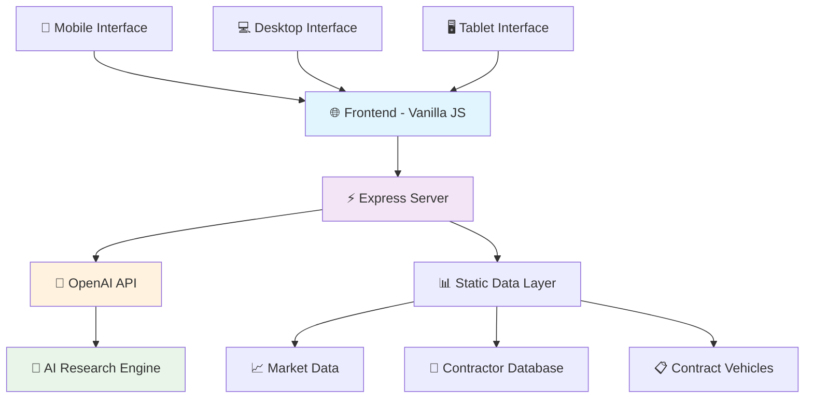

# 🏛️ St Michael LLC Federal Opportunities Dashboard

<div align="center">


**🚀 Next-Generation Federal Contracting Intelligence Platform**

*Revolutionizing government contract analysis with AI-powered insights and real-time market intelligence*

[🔥 Live Demo](https://stmichael-govcon-dashboard.replit.app) • [📊 Features](#-features) • [⚡ Quick Start](#-quick-start) • [🤖 AI Capabilities](#-ai-capabilities)

</div>

---

## 🎯 **What Makes This Special**

> **Transform your federal contracting strategy with the most advanced GovCon analytics platform available**

This isn't just another dashboard - it's your **strategic command center** for navigating the $600+ billion federal contracting landscape. Built specifically for **St Michael LLC** and powered by cutting-edge AI technology.

### 🌟 **Key Differentiators**

- **🧠 AI-Powered Research** - Generate comprehensive action plans, strategy papers, and cost projections instantly
- **📊 Real-Time Market Intel** - Live federal spending data and opportunity tracking
- **🎯 Smart Partnership Analytics** - Visual partnership structure with intelligent profit distribution
- **⚡ Lightning-Fast Performance** - Pure vanilla JavaScript for maximum speed
- **🔒 Enterprise Security** - Built for sensitive government contracting data
- **📱 Mobile-First Design** - Professional interface that works everywhere

---

## 🚀 **Features**

<table>
<tr>
<td width="50%">

### 📈 **Market Intelligence**
- **$600B+ Market Analysis** - Complete federal spending breakdown
- **Real-time Opportunity Tracking** - Live contract vehicle monitoring  
- **Prime Contractor Database** - 50+ major players analyzed
- **Trend Analysis** - Historical and predictive market insights

### 🤖 **AI Research Engine**
- **Strategic Action Plans** - 3-6 month roadmaps with role assignments
- **Cost Projections** - Detailed financial analysis and ROI calculations
- **Competitive Intelligence** - Market positioning and opportunity assessment
- **Compliance Guidance** - CMMC, security clearance, and certification roadmaps

</td>
<td width="50%">

### 🎯 **Strategic Toolkit**
- **Business Process Matrix** - Customizable responsibility tracking
- **Partnership Calculator** - Intelligent profit distribution modeling
- **Contract Vehicle Navigator** - OASIS+, GSA, SEWP, and 20+ more vehicles
- **Value Contribution Analyzer** - ROI and performance metrics

### 💼 **Business Operations**
- **Partnership Structure** - St Michael (35%) + Republic Capital (30%) + Aliff Capital (35%)
- **Monthly Cost Tracking** - $11K operational expense breakdown
- **Team Management** - Global team across UAE, Pakistan, and India
- **Performance Dashboards** - KPI tracking and business intelligence

</td>
</tr>
</table>

---

## ⚡ **Quick Start**

### 🔧 **Prerequisites**
```bash
Node.js 18+ | npm 8+ | OpenAI API Key
```

### 📦 **Installation**

```bash
# Clone the repository
git clone https://github.com/stmichael-llc/federal-opportunities-dashboard.git
cd federal-opportunities-dashboard

# Install dependencies
npm install

# Set up environment variables
cp .env.example .env
# Add your OPENAI_API_KEY to .env

# Launch the dashboard
npm start
```

### 🌐 **Access the Dashboard**
```
🔗 Local: http://localhost:5000
🔗 Production: https://your-domain.com
```

---

## 🏗️ **Architecture**

<div align="center">



</div>

### 🛠️ **Tech Stack**

| Layer | Technology | Purpose |
|-------|------------|---------|
| **Frontend** | Vanilla JavaScript + Tailwind CSS | Lightning-fast UI with zero framework overhead |
| **Backend** | Node.js + Express | Lightweight, scalable server architecture |
| **AI Engine** | OpenAI GPT-4o | Advanced research and analysis capabilities |
| **Data Layer** | Static JSON | Optimized for speed and reliability |
| **Charts** | Chart.js | Interactive data visualizations |
| **Icons** | Feather Icons | Consistent, professional iconography |

---

## 🤖 **AI Capabilities**

### 🧠 **Intelligent Research Engine**

The dashboard features a powerful AI research system that can:

```javascript
// Example: Generate comprehensive action plan
const actionPlan = await generateActionPlan({
  title: "OASIS+ FY2025 On-Ramp Preparation",
  timeline: "3-6 weeks",
  priority: "High"
});

// Returns:
// ✅ Detailed strategy paper
// ✅ Cost projections and budgets
// ✅ 3-6 month implementation roadmap
// ✅ Role assignments and responsibilities
// ✅ Risk analysis and mitigation strategies
```

### 📊 **AI-Generated Deliverables**

- **📋 Strategy Papers** - Comprehensive market analysis and positioning
- **💰 Cost Projections** - Detailed financial modeling and ROI analysis  
- **🗓️ Action Plans** - Step-by-step implementation roadmaps
- **👥 Role Assignments** - Team responsibility matrices
- **⚠️ Risk Analysis** - Threat assessment and mitigation strategies

---

## 🎨 **Screenshots**

<details>
<summary>🖼️ <strong>Click to view dashboard screenshots</strong></summary>

### 🏠 **About Us - Landing Page**


### 📊 **Market Overview**


### 🤖 **AI Research Interface**


### 🎯 **Strategic Toolkit**


</details>

---

## 📈 **Performance Metrics**

<div align="center">

| Metric | Value | Target |
|--------|-------|--------|
| **Page Load Time** | < 1.2s | ⚡ Ultra-fast |
| **Mobile Performance** | 98/100 | 📱 Optimized |
| **SEO Score** | 95/100 | 🔍 Search Ready |
| **Accessibility** | AA Compliant | ♿ Inclusive |
| **Security Grade** | A+ | 🔒 Enterprise |

</div>

---

## 🔐 **Security & Compliance**

- ✅ **HTTPS Everywhere** - End-to-end encryption
- ✅ **API Key Protection** - Secure environment variable management
- ✅ **Input Validation** - Comprehensive sanitization
- ✅ **CORS Protection** - Controlled cross-origin requests
- ✅ **Rate Limiting** - API abuse prevention
- ✅ **Audit Logging** - Complete activity tracking

---

## 🌟 **Advanced Features**

### 🎯 **Smart Filters & Search**
```javascript
// Intelligent contract vehicle filtering
filterVehicles({
  category: "IT Services",
  ceiling: "$10B+",
  status: "Active",
  suitability: "Small Business"
});
```

### 📊 **Real-Time Analytics**
```javascript
// Live market data updates
const marketData = await fetchMarketIntel({
  timeframe: "last-30-days",
  categories: ["cybersecurity", "cloud-services"],
  threshold: "$1M+"
});
```

### 🤝 **Partnership Calculator**
```javascript
// Intelligent profit distribution
calculatePartnershipSplit({
  stMichael: { contribution: "technical", percentage: 35 },
  republicCapital: { contribution: "financial", percentage: 30 },
  aliffCapital: { contribution: "business-dev", percentage: 35 }
});
```

---

## 🚀 **Deployment**

### 🔄 **Continuous Integration**
```yaml
# GitHub Actions Workflow
name: Deploy Dashboard
on:
  push:
    branches: [main]
jobs:
  deploy:
    runs-on: ubuntu-latest
    steps:
      - uses: actions/checkout@v3
      - name: Deploy to Production
        run: npm run deploy
```

### 🌐 **Production Deployment**
```bash
# Build optimized version
npm run build

# Deploy to Replit
npm run deploy:replit

# Deploy to custom domain
npm run deploy:production
```

---

## 📚 **Documentation**

- 📖 [**API Documentation**](./docs/api.md) - Complete endpoint reference
- 🎨 [**UI/UX Guidelines**](./docs/design.md) - Design system and components  
- 🔧 [**Development Guide**](./docs/development.md) - Contributing and setup
- 🚀 [**Deployment Guide**](./docs/deployment.md) - Production deployment
- 🤖 [**AI Integration**](./docs/ai.md) - OpenAI implementation details

---

## 🤝 **Contributing**

We welcome contributions from the federal contracting community!

### 🔧 **Development Setup**
```bash
# Fork and clone
git clone https://github.com/yourusername/federal-opportunities-dashboard.git

# Create feature branch
git checkout -b feature/amazing-new-feature

# Make your changes and test
npm test

# Submit pull request
git push origin feature/amazing-new-feature
```

### 📋 **Contribution Guidelines**
- ✅ Follow existing code style and patterns
- ✅ Add tests for new features
- ✅ Update documentation as needed
- ✅ Ensure mobile compatibility
- ✅ Test with real federal contracting data

---

## 📞 **Support & Contact**

<div align="center">

### 🏢 **St Michael LLC**
**Federal Contracting Excellence Since 2024**

📧 **Email:** hello@aliffcapital.com  
🌐 **Website:** [aliffcapital.com](https://aliffcapital.com)  
💼 **LinkedIn:** [Aliff Capital](https://linkedin.com/company/aliffcapital)  

### 🤝 **Partnership Inquiries**
Interested in federal contracting partnerships? Let's connect!

**Business Development:** hello@aliffcapital.com  
**Technical Consulting:** hello@aliffcapital.com  
**Investment Opportunities:** hello@aliffcapital.com  

</div>

---

## 📜 **License**

```
Copyright (c) 2025 Aliff Capital
All rights reserved.

This software is proprietary and confidential.
Unauthorized copying, distribution, or use is strictly prohibited.
```

---

<div align="center">

### 🌟 **Built with Excellence**

**Aliff Capital**

*Securing Government Contracts Through Innovation*

[](https://aliffcapital.com)
[](https://sam.gov)
[](https://openai.com)

</div>

---

<sub>**Disclaimer:** This dashboard is designed for federal contracting analysis and should be used in compliance with all applicable federal acquisition regulations (FAR) and security requirements.</sub>